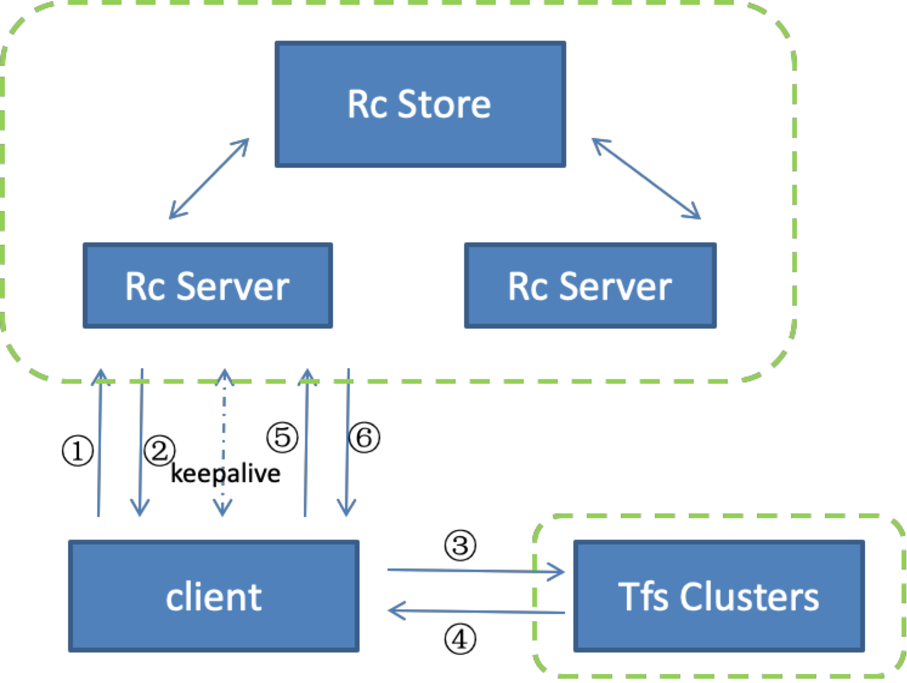

# Resource Center Server

> 原文来自：<https://github.com/taobao/tfs/tree/master/doc/resource_server>

## 功能概述

TFS 是淘宝底层存储系统，服务与众多的淘宝应用。 TFS本身没有权限管理， 各种权限其实都是上层应用根据各自的具体应用场景来实现的。 因为所有应用在TFS中都不加以区分，这给TFS维护工作带来了一些不便。 于是我们增加了一个 **RC 服务器，用来对应用做简单的管理**。

RC Server 是 Resource Center Server 的简写，是 tfs 集群的用户资源配置管理中心。它用来管理使用TFS的上层应用的配置信息，统计资源使用情况， 统计各种操作数据。其中， 配置信息包括该应用对哪些TFS集群具有读写权限， 该应用是否需要进行排重操作等。 统计的资源使用情况会记录该应用消耗的存储空间， 统计操作信息会记录各种操作次数， 失败率情况， 缓存命中等情况。

上述功能的实现， 主要是通过在客户端记录相关信息， 用后台线程定时汇报给 RC server。 因为这些统计信息只是为了管理方便， 只需要具有参考意义， 并不要求非常准确，所以当RC server发生不可访问等故障的时候，不会影响应用对 TFS 的使用, 仅仅会造成统计信息的部分缺失。

## 逻辑关系图

RC server与TFS client 以及TFS集群的逻辑关系如下图：

## 工作原理

RC server 可以部署多台，客户端获得种子 RC server 列表，在启动时从该 RC server 获得基本配置信息，同时可以获得所有可用 RC server 的列表。 从列表中选择一台作为 active。向该 RC server 汇报自己的统计信息。如果期间有连接失败（例如该 RC server 宕机），可以选择 server 列表中下一台作为 active。依次循环。如果所有 RC server 都不能连接，client 还可以把统计的信息先保存在自己的内存, 通过定时重试机制，找到可用的 RC server 后再向 RC server 汇报。所以只要客户端完成了启动过程, RC server 的宕机对客户端的正常读写等都无影响。

用户（对淘宝来讲就是各种上层应用）使用 TFS 的具有 RC 功能的客户端时， 必须先向 TFS 的维护人员申请一个 appkey,  该 appkey 相当于这个应用的登录密码， 用户使用该 appkey 登录到 RC server, 取得运行需要的配置数据, 并且在 RC server 端生成一个 session 信息。用户在使用过程中, 客户端的后台线程会汇报统计信息给 RC server, 同时检查 RC server 上的配置信息是否有更新, 如果有更新, 则自动更新到客户端。当用户退出运行的时候, 会向 RC server 发送 log out 消息, RC server 会清理相关的 session 信息。

## 交互流程举例

如上图，从client角度，以写文件为例，描述交互流程如下：

- client根据初始配置的RC server种子地址，向RC server发送login 请求.
- RC server根据login请求中的appkey，验证其是否是一个已经注册的应用， 生成sessionId，连同appkey对应的配置信息一起返回给client。client根据返回的sessionId和汇报间隔，与 RC server之间建立keepalive。
- client获得配置信息，进行写操作。此时，client会从可写集群中选择最近的一个进行写操作，根据配置信息中是否要求排重，决定此次写是否排重。（写操作具体流程和现有流程一样，不再详述）。
- 写操作执行完成。client会记录此次操作的响应时间，写的数据大小。这些统计信息会在keepalive过程中汇报给RC server，RC server会汇总相应应用的信息，定时向数据库中持久化。
- Client退出的时候，先将最后尚未汇报的统计信息汇报, 然后发送logout 消息。
- RC server 清理相关session 的状态。

## RC server中的表

RC store持久化保存用户的配置和管理信息，目前我们使用mysql 来做持久化存储。数据库中有

- t_resource_server_info

- t_cluster_rack_info

- t_cluster_rack_group

- t_cluster_rack_duplicate_server

- t_app_info

- t_base_info_update_time

- t_session_info

- t_session_stat

- t_app_stat

表的字段具体介绍参见源码doc目录下的数据字典。下面做一些简要的说明.

- t_resource_server_info

- t_cluster_rack_info

- t_cluster_rack_group

- t_cluster_rack_duplicate_server

- 四张表为记录集群基础配置信息的表（base table）。

  

t_resource_server_info记录RC server集群的列表

说明几个概念: TFS物理集群 cluster, 逻辑集群 cluster_rack, 集群组cluster_rack_group。

- Cluster表示当前 TFS架构中的一个物理集群.
- Cluster_rack 是逻辑集群, 由一个或几个物理集群组成，对于用户来说, 用户关心的是自己使用逻辑集群.  打一个比方, 物理集群好像是一些物理盘片, 逻辑集群把他们组合成一个逻辑卷, 用户只需要关心逻辑集群.
- Cluster_rack_group表示几个逻辑集群组合成一个集群组提供给用户使用。一个cluster_rack_group可以包含几个cluster_rack。这是针对用户的不同需求，给出对应的组合。

每个cluster_rack_group中的每个cluster_rack都有权限控制（不可访问，可读，可读写），每个cluster_rack中的每个cluster也有权限控制。分配给用户以cluster_rack_group为单位。针对不同的应用，组合出不同的cluter_rack_group 提供使用。用户最终对一个cluster的访问权限受限于权限层次中的最小权限值。

duplicate_server是排重集群。每个cluster_rack对应有一个duplicate_server集群（或者没有）。duplicate_server集群现在使用tair。

- t_app_info是用户注册信息表（app table），注册用户的信息都保存在这个表中。
- t_base_info_update_time表用来通知RC server配置的信息有更新。其中的base_last_update_time字段标识base table的更新时间， app_last_update_time 标识app  table的更新时间。

更新app相关信息或者base table后，需要再更新 t_base_info_update_time中对应的的字段，RC server的定时检测进程就可以检测到配置信息的更新，重新reload，并且通知client。

- t_session_info，t_session_stat，t_app_stat 三张表是动态变化的表。

- t_session_info记录的是与client连接的session的信息。包含client的cache size，cache count, client version。
- t_session_stat记录的是与client连接的session操作的信息。包含每种操作（读写删等）的平均响应时间，数据大小，成功失败次数等。
- t_app_stat记录着用户（根据t_app_info,中appKey对应的id）的使用容量，文件数目等。